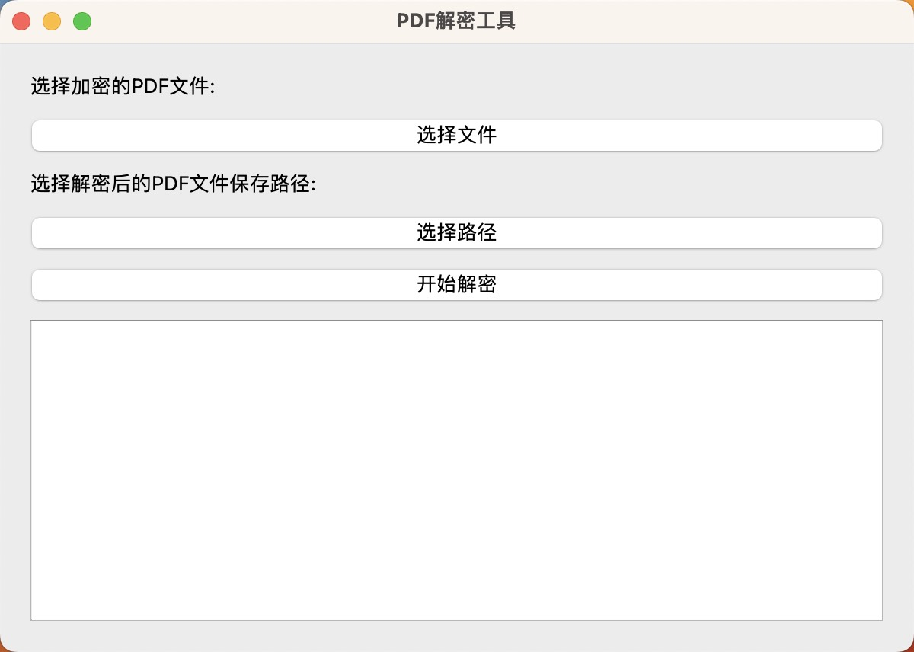

# PDF 解密工具

## 介绍

PDF 解密工具，支持解密 PDF 文件的密码，Python 编写，支持 Windows、Linux、macOS（需要自己准备运行环境）。



## 使用方法

1. 安装 Python 运行环境（Python 3.6+）；

2. 安装依赖库：

   ```bash
   pip install -r requirements.txt
   ```

3. 运行程序：

   ```bash
   python main.py
   ```
